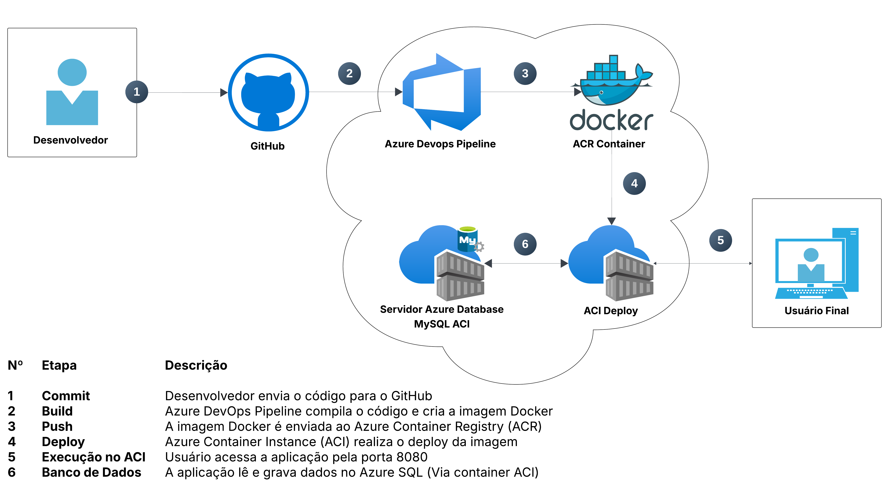

# 🧠 **SkillBridge – Java Analytics API**

### *Plataforma de Métricas, Relatórios e Evolução Profissional usando IA | DevOps – ACR, ACI, Pipelines, SQL Server*

---

## 👥 **Integrantes**

| Nome                  | RM       | Turma  |
| --------------------- | -------- | ------ |
| **Felipe Clarindo**   | RM554547 | 2TDSPF |
| **Humberto de Souza** | RM558482 | 2TDSPX |
| **Vinicius Beda**     | RM554914 | 2TDSPX |

---

# 📌 **1. Visão Geral do Projeto**

A **Java Analytics API** é o serviço responsável por consolidar dados do ecossistema *SkillBridge*, realizando análises de progresso, desempenho e evolução profissional dos usuários — gerando respostas em JSON consumidas pelo aplicativo mobile, pelo módulo de IA e por outras APIs internas.

Ela utiliza um banco estruturado (SQL Server) e entrega relatórios inteligentes que alimentam toda a experiência do SkillBridge.

---

# 🎯 **2. Propósito do Projeto**

O **SkillBridge** tem como missão **democratizar a requalificação profissional** diante de um mercado transformado por IA, automação e tecnologias emergentes.

A plataforma:

* Identifica **lacunas de competências**
* Gera **trilhas personalizadas de aprendizado**
* Mede **progresso real** em métricas
* Oferece **mentoria inteligente via IA**

A *Analytics API* transforma dados em **insights**, permitindo que usuários, empresas e o próprio motor de IA tomem decisões baseadas em evidências.

---

# 🏗️ **3. Arquitetura da Solução**



---

# 🧩 **4. Componentes da Arquitetura**

### ✔ Azure Repos

Repositório privado, versionado com Git, contendo:

* Código fonte da API (Java 17 + Spring Boot)
* Dockerfile
* Scripts de infraestrutura
* Pipelines (Build e Release)
* JSON de exemplos CRUD
* Script SQL

### ✔ Azure Boards

Usado para rastrear tarefas e conectar:

* Branches
* Commits
* Pull Requests

### ✔ Azure Pipelines

**Build (CI)**

* Dispara somente em merge na branch *main*
* Publica artefatos
* Publica testes (JUnit)
* Faz build + push para o ACR

**Release (CD)**

* Dispara automaticamente após a Build
* Executa script Azure CLI
* Realiza deploy no ACI (API)
* Atualiza DNS e credenciais
* Conecta com SQL Server em ACI

### ✔ Azure Container Registry (ACR)

Armazena as imagens Docker geradas no CI.

### ✔ Azure Container Instances (ACI)

* **aci-skillbridge-api** → executa a API Java
* **aci-sqlskillbridge** → executa SQL Server containerizado (banco oficial do projeto)

### ✔ Banco SQL Server

Esse banco contém todas as tabelas da plataforma:

* Usuários
* Competências
* Trilhas
* Cursos
* Recomendações
* Entre outras

---

# ⚙️ **5. Script de Infraestrutura (Azure CLI)**

```
/scripts/script-infra.sh
```

> Este script cria automaticamente:
> ☑ Resource Group
> ☑ ACR
> ☑ ACI-API
> ☑ ACI-SQL
> ☑ DNS público
> ☑ Usuário e senha do SQL

---

# 🧪 **6. Script do Banco **

/scripts

├── crud-usuarios.json        # Arquivo JSON de exemplos CRUD
├── data.sql                  # Inserts para popular o banco
├── schema.sql                # Criação das tabelas
├── script-infra.sh           # Script de infraestrutura Azure CLI


# 🐳 **7. Dockerfile Oficial**
Arquivo fica em:

```
/Dockerfile
```

Exemplo padrão usado na sua app:

```dockerfile
FROM eclipse-temurin:17-jdk-alpine as build
WORKDIR /workspace/app

RUN apk add --no-cache maven

COPY pom.xml .
COPY src src

RUN mvn clean package -DskipTests

FROM eclipse-temurin:17-jre-alpine
WORKDIR /app

COPY --from=build /workspace/app/target/*.jar app.jar

EXPOSE 8080

ENTRYPOINT ["java","-jar","/app.jar"]
```

---

# 🚀 **8. Pipeline de Build (azure-pipelines.yml)**

```
trigger:
  branches:
    include:
      - main

pr:
  branches:
    include:
      - main

pool:
  vmImage: 'ubuntu-latest'

steps:
  - task: Maven@3
    inputs:
      mavenPomFile: "pom.xml"
      goals: "package"
      publishJUnitResults: true
      testResultsFiles: "**/surefire-reports/*.xml"

  - task: Docker@2
    inputs:
      command: buildAndPush
      containerRegistry: "$(dockerRegistryServiceConnection)"
      repository: "fiap/skillbridge-api"
      dockerfile: "**/Dockerfile"
      tags: |
        $(Build.BuildId)
```

> ✔ Build roda **somente após merge na main via PR**
> ✔ Publica artefatos + testes
> ✔ Gera imagem final e envia ao ACR

---

# 🔁 **9. Release Pipeline (CD)**

Executa automaticamente após a Build:

* Baixa artefatos
* Executa o script Azure CLI
* Atualiza o ACI
* Mantém DNS
* Reinicia a API

---

# 📄 **10. CRUD JSON (obrigatório)**

Arquivo:

```
crud-usuarios.json
```

Conteúdo:

```json
{
  "endpoints": [
    {
      "method": "GET",
      "url": "/api/users",
      "description": "Lista paginada de usuários"
    },
    {
      "method": "GET",
      "url": "/api/users/1",
      "description": "Busca usuário por ID"
    },
    {
      "method": "POST",
      "url": "/api/users",
      "description": "Cria um novo usuário",
      "body": {
        "nome": "Ana Silva",
        "email": "ana.silva@skillbridge.ai"
      }
    },
    {
      "method": "PUT",
      "url": "/api/users/1",
      "description": "Atualiza usuário",
      "body": {
        "nome": "Ana Silva Atualizada",
        "email": "ana.novo@skillbridge.ai"
      }
    },
    {
      "method": "DELETE",
      "url": "/api/users/1",
      "description": "Remove usuário"
    }
  ]
}
```

---

# 🔐 **11. Boas Práticas e Segurança**

A GS exige:

✔ Variáveis de ambiente nas pipelines
✔ Dados sensíveis protegidos (senhas, connection string)
✔ Sem expor credenciais no código

Exemplo de variável:

```
$(SQL_PASSWORD)
$(ACR_PASSWORD)
$(DB_URL)
```

---

# 🧪 **12. Testes Automatizados**

A pipeline publica:

* Testes JUnit
* Cobertura (se configurado)
* Artifacts
✔ CRUD JSON
✔ Arquitetura macro
✔ Boas práticas de segurança
